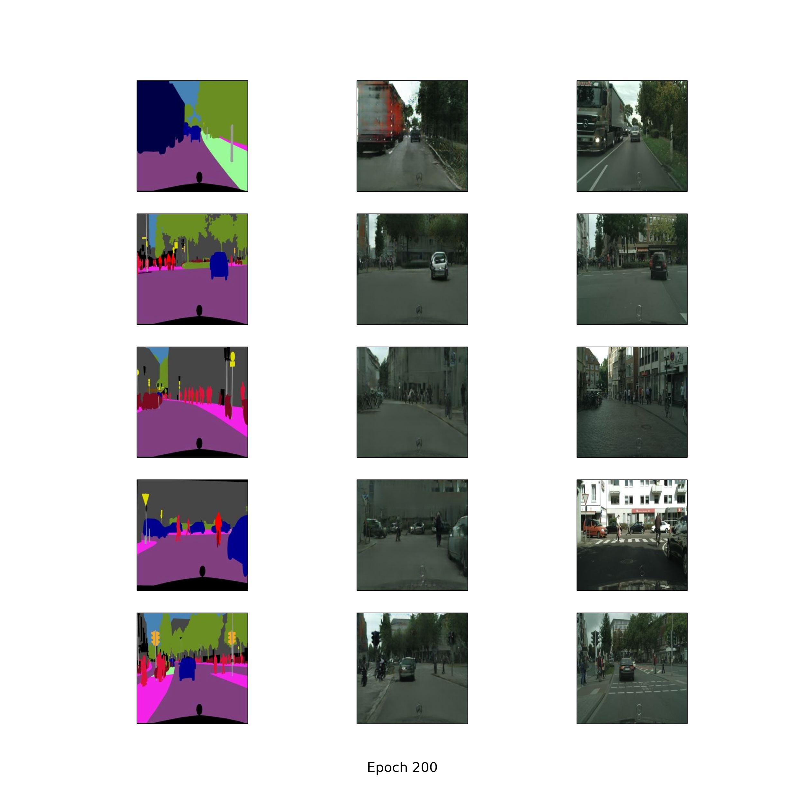
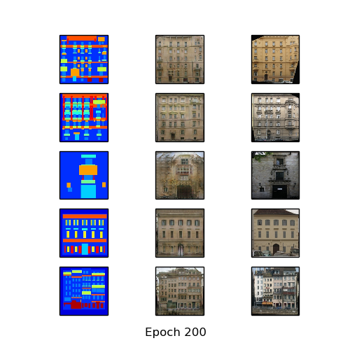

# pytorch-pix2pix
Pytorch implementation of pix2pix [1] for various datasets.

* you can download datasets: https://people.eecs.berkeley.edu/~tinghuiz/projects/pix2pix/datasets/
* you can see more information for network architecture and training details in https://arxiv.org/pdf/1611.07004.pdf

## dataset
* cityscapes
  * 2,975 training images, 200 train epochs, 1 batch size, inverse order: True
* facades
  * 400 training images, 200 train epochs, 1 batch size, inverse order: True
* maps
  * 1,096 training images, 200 train epochs, 1 batch size, inverse order: True
* edges2shoes
  * 50k training images, 15 train epochs, 4 batch size, inverse order: False
* edges2handbags
  * 137k training images, 15 train epochs, 4 batch size, inverse order: False

## Resutls
### cityscapes
* cityscapes after 200 epochs
  * First column: input, second column: output, third column: ground truth
  

* Generate animation for fixed inputs

* Learning Time
  * cityscapes pix2pix - Avg. per epoch: 332.08 sec; Total 200 epochs: 66,846.58 sec
 
### facades
* facades after 200 epochs
  * First column: input, second column: output, third column: ground truth
  

* Generate animation for fixed inputs

* Learning Time
  * facades pix2pix - Avg. per epoch: 44.94 sec; Total 200 epochs: 9,282.64 sec
  
## Development Environment

* Ubuntu 14.04 LTS
* NVIDIA GTX 1080 ti
* cuda 8.0
* Python 2.7.6
* pytorch 0.1.12
* torchvision 0.1.8
* matplotlib 1.3.1
* imageio 2.2.0
* scipy 0.19.1

## Reference

[1] Isola, Phillip, et al. "Image-to-image translation with conditional adversarial networks." arXiv preprint arXiv:1611.07004 (2016).

(Full paper: https://arxiv.org/pdf/1611.07004.pdf)
